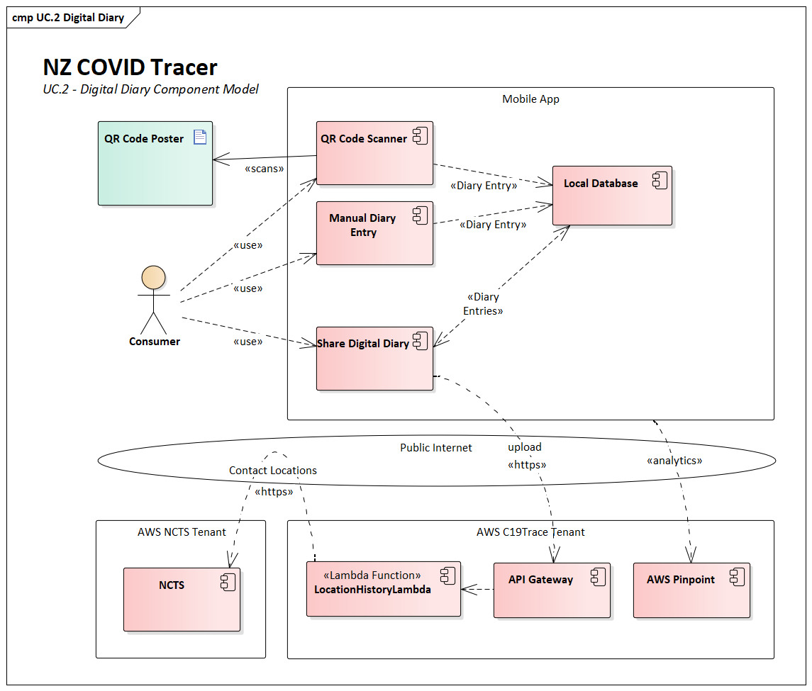
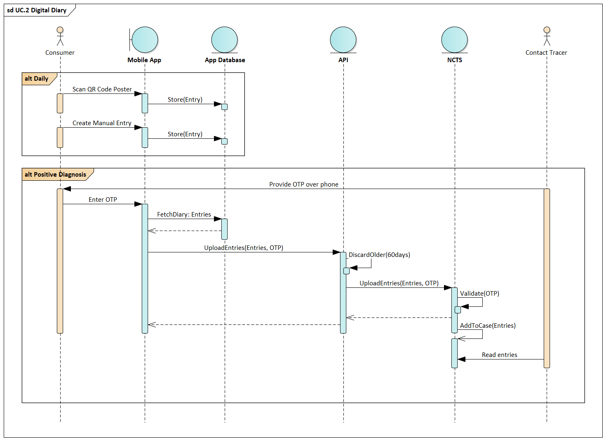

# NZ COVID Tracer - Digital Diary

If a person tests positive for COVID-19 a key part of the case investigation is
understanding where that person went while they were infectious. The difficulty 
is people often find it difficult to remember their precise daily movements 
during this time. The Digital Diary can be used to keep a private record of 
where a user has been on their device. 

The privacy of the digital diary is paramount, and the Ministry has no interest 
in compiling a centralised database of the places a person has been. For this 
reason, the diary is kept locally on the person’s device, and only uploaded if 
the person chooses to if they test positive for COVID-19 and are requested to 
by a contact tracer.

Each time the app returns to the foreground entries that have been created more 
than 60 days ago are automatically deleted, in line with clinical advice on the 
amount of data that is necessary to support a case investigation.

If a user uses multiple phones a separate diary is kept on each device. This 
solution does not implement a function to share a diary between devices. This
means if the app is uninstalled any diary entries on the device will be lost.

The user uses the app to record entries in their digital diary. An entry is
created by:

 - Scanning a compatible QR Code containing a GLN, Location Name, and Address.
   The specification for the QR code is published on the Ministry website, and 
   posters can be requested using the Rapid QR Service  also operated by the 
   Ministry. Users can also add notes for any scanned entry after scanning.

   The GLN is obtained through the creation of an Organisation Part within the 
   NZBN register, operated by the Companies Office in the Ministry of Business,
   Innovation, and Employment. Organisation Parts are based on NZS ISO/IEC 
   6523.1.

 - Creating a ‘manual entry’ by filling in the Location Name, Time of Arrival, 
   and any notes about the location.

## Sharing the digital diary

If the user tests positive for COVID-19, they will be called by a contact 
tracer for a case investigation. As part of this call the user can consent to 
share a copy of their digital diary with the contact tracer to assist with the 
case investigation.

If the user consents, the contact tracer gives the user a 6-digit 
one-time-password (OTP) over the phone. This OTP is entered into the app and 
any entries from the last 60 days are uploaded.

  1. The user is given a one-time-password (generated by NCTS) over the phone 
     by the contact tracer. This is what links the diary upload to the correct 
     case in the NCTS. 
  2. The user submits the OTP, and the app collects any relevant diary entries 
     and uploads them to the API.
  3. The API strips any entries that are older than 60 days, and then proxies 
     this request to the NCTS via a REST API.
  4. The NCTS validates that the OTP is valid, if not an error is returned to 
     the user to try again.
  5. The diary entries are attached to the Case record in NCTS as Contact 
     Locations, which are then able to be reviewed by the contact tracer as 
     during their case investigation.
